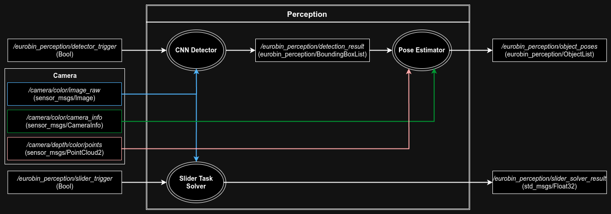
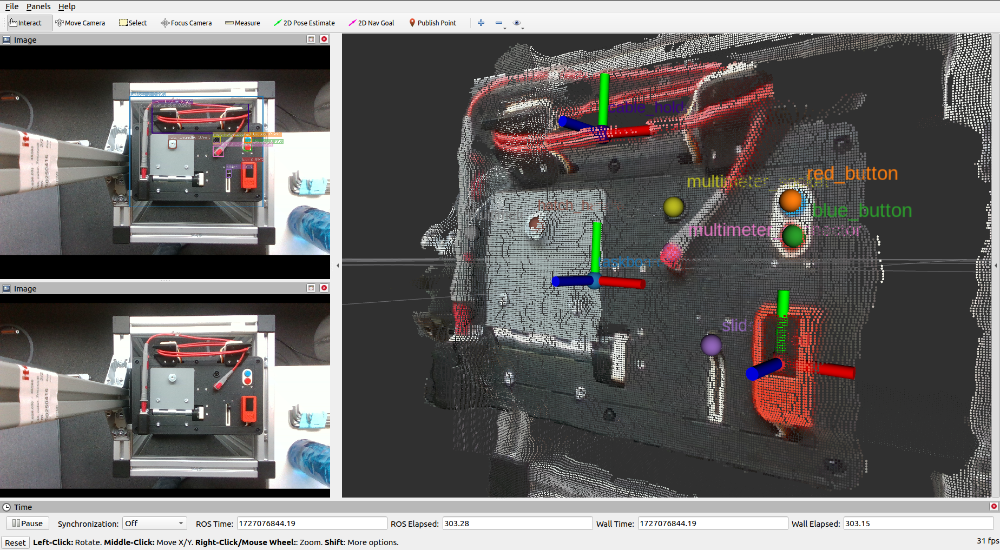
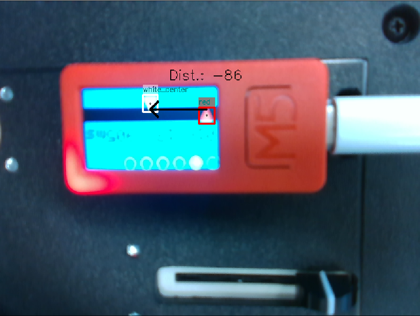
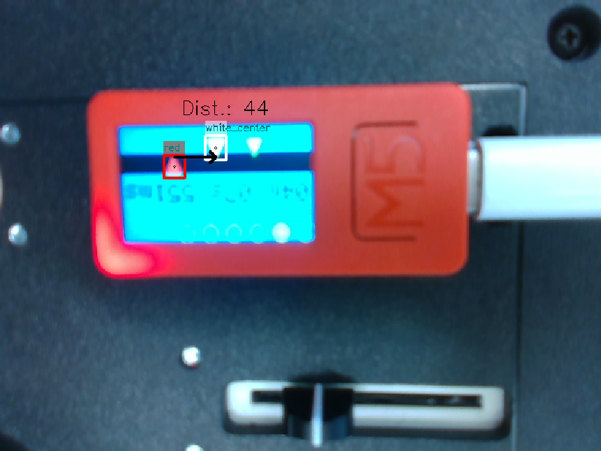

<div align="center">

# tum-tb-perception

A ROS package that contains the core perception libraries and tools for the euROBIN task board challenge.

Designed for and tested on Ubuntu 22.04 LTS, ROS Melodic with Python 3.8/3.10, and an Intel Realsense D435i.

<b>Note: The package is in an initial development phase. It is unstable and may significantly change in concept and implementation.</b>
  
[](https://www.python.org/downloads/release/python-380/)
[](https://opensource.org/licenses/MIT)

</div>

## Contents
- [➤ Overview](#overview)
- [➤ Example Results](#example-results)
- [➤ Main Components](#main-components)
    - [Object Detector](#object-detector)
    - [Pose Estimator](#pose-estimator)
    - [Slider Task Solver](#slider-task-solver)
- [➤ Installation](#installation)
- [➤ Usage](#usage)
- [➤ Directory Structure](#directory-structure)
- [➤ Dependencies](#dependencies)
- [➤ Future Plans](#future-plans)

## Overview

To solve the euRobin challenge, <b>tum_tb_perception</b> implements the following perception functionalities by utilizing RGB-D sensor data:
* detecting and estimating the locations of a task board and its components to enable a robot to reach and manipulate each component,
* estimating the positions of elements on the LCD screen to solve the slider task.

The detection and localization of the task board components consists of two parts. A [Faster R-CNN](https://pytorch.org/vision/main/models/faster_rcnn.html) CNN model that has been trained on a dataset of RGB task board images is deployed on a <b>CNN detector</b> node. A <b>pose estimator</b> node then uses the detection result and depth point cloud data to estimate the 3D position of each detected task board component and the pose of the task board (position and orientation).

The perception aspect of the slider task: estimating the distance between a start and and end marker on the LCD screen, is handled by a <b>slider task solver</b> node.

Both functionalities can be triggered through ROS or UDP messages.

The diagram below visualizes the three nodes within this package and their input and output ROS topics and messages.



## Example Results

Taskboard CNN detection and pose estimation results from the <b>CNN detector</b> and <b>pose estimator</b> nodes shown on RViz:
<p float="left" align="center">
   
</p>

&nbsp;

LCD marker identification and slider motion distance estimation from the <b>slider task solver</b> node:

<p float="left" align="center">
  
   
</p>

## Main Components

### Object Detector

The `cnn_detector_node` loads a pre-trained detection model and runs continuously; for each received trigger message, it:
* runs the model on the latest image from a ROS topic
* publishes and optionally visualizes the detection result

### Pose Estimator

The `pose_estimator_node` runs continuously; for each received detection result, it:
* extracts segments of the point cloud that correspond to each object that was detected in the image; for this, each 3D point is back-projected onto the image plane to determine if it lies within a given bounding box.
* estimates the 3D position of each detected object through a measure of the aggregate of its pointcloud segment (currently the mean).
* estimates the 3D orientation of the task board from its point cloud segment.
* publishes and optionally visualizes the object positions and a coordinate frame that describes the pose of the task board.

In order to estimate the task board orientation, we find a coordinate frame whose i) `z`-axis points perpendicular to the face and upwards, ii) `x`-axis points from the left to the right side of the board, and iii) `y`-axis points from the bottom to the top side of the board. This is achieved by:
* filtering the point cloud segment to remove outliers
* fitting a plane through the remaining points and computing its normal vector; this vector represents the `z`-axis of the task board
* projecting all points onto the plane and fitting a minimum-bounding rectangle on the points; the sides of this rectangle are parallel to the `x` and `y` axes of the task board
* if possible, finding the specific directions of the `x` and `y` vectors using information about the 3D positions of objects:
  * dividing the task board rectangle into four quadrants
  * recognizing quadrants 1-4 from the objects that lie within them (e.g. `slider` is expected to be inside quadrant 4)
  * finding the corresponding corners of the task board
  * setting the directions of `x` and `y` such that they point towards the two right-side corners and the top-side corners, respectively.

### Slider Task Solver

The `slider_task_solver_node` runs continuously; for each received trigger message, it:
* runs a simple, `OpenCV`-based template matching algorithm on the latest image from a ROS topic to detect triangle markers. Which marker colours are searched for depends on the current `task_stage`:
  * 1: moving red triangle to center white triangle
  * 2: moving red triangle to green triangle
* estimates the distance between the relevant markers in image space
* estimates the distance to move the slider in order to move the controller marker to the goal marker
* publishes and optionally visualizes the estimated motion distance result


## Installation

### Install Dependencies

After cloning this repository into your catkin workspace, it is recommended to first install the Python package dependencies using `pip` by running the following within this directory:
```
pip install -r requirements.txt
```

### Build Package

Build the package using:
```
catkin build tum_tb_perception
```

### Download Detection Model

Run the following script from within this directory, which will download the Pytorch-based detection model to a `models` sub-directory:

```bash
./download_model.sh
```

## Usage

First, ensure that following topics containing the camera sensor data are available (the topic names are configurable in the launch files):
* `/camera/color/image_raw`: `sensor_msgs/Image` messages containing RGB images
* `/camera/depth/color/points`: `sensor_msgs/PointCloud2` messages containing point cloud data
* `/camera/color/camera_info`: `CameraInfo` messages containing the camera's intrinsic parameters.

In our case, these are obtained from an Intel Realsense D435i camera and by running the official [realsense-ros](https://github.com/IntelRealSense/realsense-ros) launch file:
```bash
roslaunch realsense2_camera rs_camera.launch filters:=pointcloud
```

Start the pose estimator node:
```bash
roslaunch tum_tb_perception pose_estimator.launch
```

Start the object detector node:
```bash
roslaunch tum_tb_perception object_detector.launch
```

Start the slider task solver node:
```bash
roslaunch tum_tb_perception slider_task_solver.launch
```

Note: the recommended way to run the components is through the launch files, because they ensure the correct configuration of various parameters (config file paths, etc.).

To detect the task board and its components, position the camera above the approximate location of the task board looking down (see, for example, the perspective shown on the illustrative RViz image [above](#example-results)).
Then, trigger the object detection and subsequent pose estimation by publishing:
```bash
rostopic pub -1 /tum_tb_perception/detector_trigger std_msgs/Bool "data: true"
```
The estimated task board and component poses will be published on the `/tum_tb_perception/object_poses` topic.

<!-- Add custom ROS message specifications -->

To estimate the solution for the slider task, position the camera above the LCD screen (see, for example, the perspective shown on the illustrative image of the screen [above](#example-results)).
Then, trigger the slider distance estimation by publishing:
```bash
rostopic pub -1 /tum_tb_perception/silder_solver_trigger std_msgs/Bool "data: true"
```

The estimated slider motion distance will be published on the `/tum_tb_perception/slider_solver_result` topic.

### Alternative Triggering and Data Retrieval: UDP Messages

Instead of ROS messages, the nodes enable communication through UDP messages to:
* trigger the components (only if the components `run_on_udp_trigger` and `run_on_ros_trigger` launch arguments are set to `true` and `false`, respectively.
* receive outputs.

Both the detection + pose estimation and slider task solution nodes can be triggered by sending the following UDP message: a JSON-style `dict`, to the correct UDP ports (see default `udp_trigger_port` values in the respective launch file):
```
{
    "trigger": "True"
}
```

The estimated task board and component poses will be sent over the `udp_output_port` port with the format shown in the following example:
<details>
<summary> Example TaskBoard Pose Estimation Result UDP Message </summary>

```
{
    "orientation_success": "True",
    "object_list": [
        {
            "label": "cable_holder",
            "position": [
                -0.07609273149868587,
                -0.08745270965240141,
                0.42824359700155523
            ],
            "orientation": [
                0.9700542761143782,
                -0.2317175173391077,
                0.05979320155914142,
                0.04155077132518572
            ]
        },
        {
            "label": "slider",
            "position": [
                0.03128450507806106,
                0.0012224855114231128,
                0.4247597572091338
            ],
            "orientation": [
                0.9700542761143782,
                -0.2317175173391077,
                0.05979320155914142,
                0.04155077132518572
            ]
        },
        {
            "label": "taskboard",
            "position": [
                0.05042527882671183,
                -0.004413772358169423,
                0.4495594591230038
            ],
            "orientation": [
                0.9998330020640216,
                0.017209484030706178,
                -0.00390767519065893,
                0.004746758646412086
            ]
        },
        ....
    ]
}

```

</details>

The estimated slider motion distance will be sent over the `udp_output_port` port with the format shown in the following example:
<details>
<summary> Example Slider Motion Distance Estimation Result UDP Message </summary>

```
{
    "slider_motion_distance": "1.4"
}
```
</details>

## Directory Structure

<details>
<summary> Package Files </summary>

```
tum-tb-perception
│
├── src
│   └── tum_tb_perception
│       ├── __init__.py
│       ├── image_detection.py
│       ├── pose_estimation.py
│       ├── dataset.py
│       ├── models.py
│       ├── utils.py
│       └── visualization.py
│
├── ros
│   └── scripts
│   |   ├── single_cnn_detector_node
│   |   ├── continuous_cnn_detector_node
│   |   ├── slider_task_solver_node
│   |   └── pose_estimator_node
│   └── launch
│       ├── object_detector_single.launch
│       ├── object_detector.launch
│       ├── slider_task_solver.launch
│       └── pose_estimator.launch
│
├── config/
│   ├── labels.txt
│   └── class_colors_taskboard.yaml
│
├── models/
│   └── slider_solver_templates_images
│
├── msg/
├── download_model.sh
├── setup.py
├── CMakeLists.txt
├── package.xml
├── requirements.txt
├── README.md
└── LICENSE
```

</details>


## Dependencies

* `cv2`
* `cv_bridge`
* `matplotlib`
* `numpy`
* `pandas`
* `rospy`
* `rospkg`
* `scipy`
* `torch`
* `torchvision`

For ROS:

* `geometry_msgs`
* `std_msgs`
* `sensor_msgs`
* `tf2_ros`
* `tf_conversions`
* `visualization_msgs`

## Future Plans

- [X] Separate core code and ROS interfaces.
- [X] Implement estimation of slider task solution.
- [ ] Include dependecy: `tum_tb_perception_msgs`.
- [ ] Include complete code and instructions for training the detection model.
- [ ] Implement continuous detection + pose estimation (detection may require GPU).
- [ ] Implement pose estimation in C++ (if pointcloud processing run-time improves).
- [ ] Create a ROS2 interface.

<!-- TODO: Add references, etc., if any
## Credits
* ...
 -->
